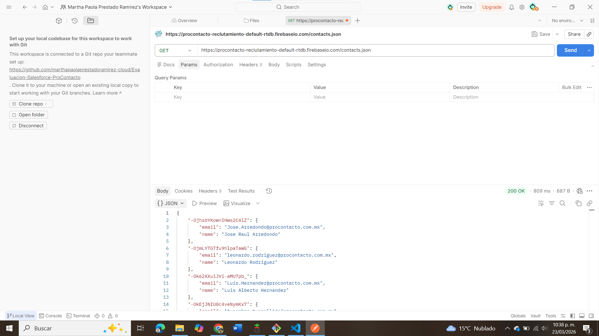
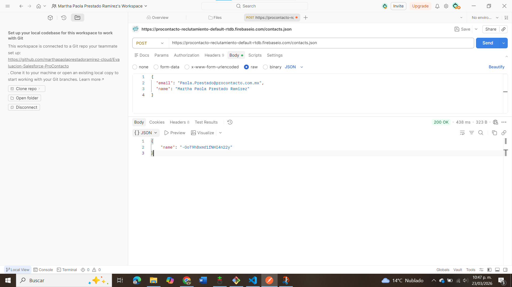
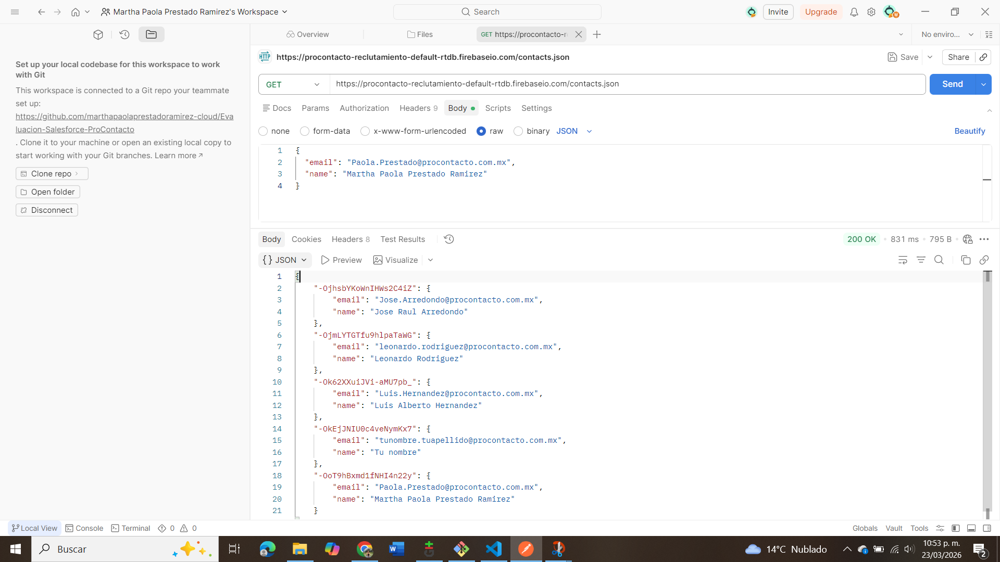
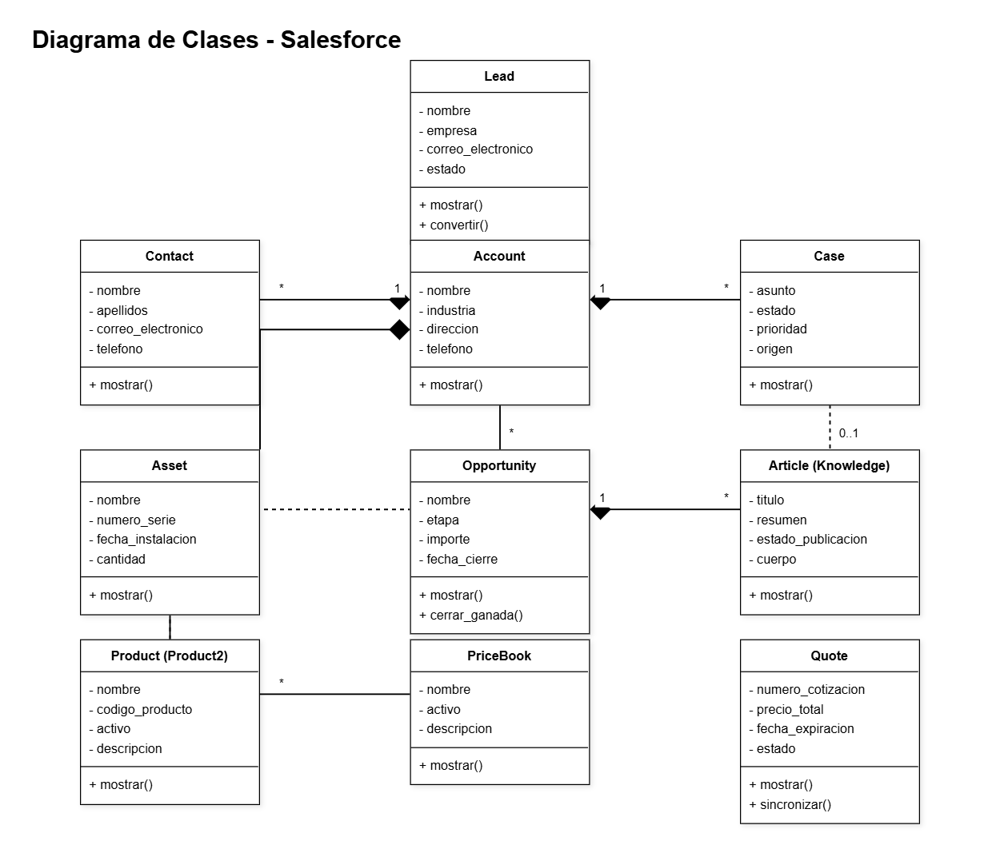

#  Evaluación Técnica Salesforce - ProContacto

###### Este repositorio contiene la resolución de la prueba técnica para el proceso de selección como Salesforce Developer.
---
# 📑 Índice

<details>
<summary> Ejercicio 1 - Instalación del ambiente</summary>
[Ir a la sección](#ejercicio-1---instalacion-del-ambiente)
</details>

<details>
<summary> Ejercicio 2 - Protocolo HTTP</summary>
[Ir a la sección](#ejercicio-2---protocolo-http)
</details>

<details>
<summary> Ejercicio 3 - Uso de POSTMAN</summary>
[Ir a la sección](#ejercicio-3---uso-de-postman)
</details>

<details>
<summary> Ejercicio 4 - Trailhead</summary>
[Ir a la sección](#ejercicio-4---trailhead)
</details>

<details>
<summary> Ejercicio 5 - Objetos de Salesforce y Relaciones</summary>
[Ir a la sección](#ejercicio-5---objetos-de-salesforce-y-relaciones)
</details>

<details>
<summary> Ejercicio 6 - Conceptos Generales y Soluciones de Salesforce</summary>
[Ir a la sección](#ejercicio-6---conceptos-generales-y-soluciones-de-salesforce)
</details>

<details>
<summary> Ejercicio 7 - Desarrollo en Apex y Clases</summary>
[Ir a la sección](#ejercicio-7---desarrollo-en-apex-y-clases)
</details>

---
## Ejercicio 1 - Instalación del ambiente

Para la realización de esta prueba técnica se configuró el siguiente entorno de desarrollo:

### 🔹 Visual Studio Code
Se instaló Visual Studio Code como entorno de desarrollo principal, el cual permite trabajar con múltiples lenguajes como JavaScript, HTML, CSS y Apex.

Se agregaron extensiones como:
- Salesforce Extension Pack
- Prettier
- GitLens

### 🔹 Git y Git Bash
Se instaló Git como sistema de control de versiones para gestionar los cambios en el código.

Se configuraron las credenciales globales con los siguientes comandos:

```bash
git config --global user.name "Martha Paola Prestado Ramirez"
git config --global user.email "marthapaolaprestadoramirez@gmail.com"
```
------------

## 🌐 Ejercicio 2 - Protocolo HTTP

### 1. ¿Qué es un servidor HTTP?
Un servidor HTTP es un sistema que se encarga de recibir solicitudes (requests) de clientes, como navegadores web, y responder con recursos como páginas HTML, imágenes o datos.

Funciona bajo el protocolo HTTP, permitiendo la comunicación entre cliente y servidor en aplicaciones web.

### 2. ¿Qué son los verbos HTTP?

Los verbos HTTP son métodos que indican la acción que se desea realizar sobre un recurso en un servidor.

Los más comunes son:

* `GET` (Obtener datos)
* `POST` (Enviar datos nuevos)
* `PUT` / `PATCH` (Actualizar datos)
* `DELETE` (Eliminar datos)
* `PATCH` (Modificar parcialmente datos)

### 3. ¿Qué es un request y un response en una comunicación HTTP? ¿Qué son los headers?
* **Request (Petición):** Es el mensaje que el cliente envía al servidor solicitando una acción o información.
* **Response (Respuesta):** Es el mensaje que el servidor devuelve al cliente tras procesar el request, conteniendo el estado de la operación y, de ser necesario, los datos solicitados.
* **Headers (Encabezados):** Son metadatos que acompañan tanto al request como al response. Proporcionan contexto adicional sobre la comunicación, como el tipo de navegador, tokens de seguridad, formato de los datos, etc.

### 4. ¿Qué es un queryString?

Es una parte de la URL que se utiliza para enviar parámetros o variables estructuradas al servidor. Comienza después de un signo de interrogación `?` y agrupa pares de clave-valor separados por un ampersand `&`

 * Ejemplo:
https://api.com/users?name=Pao&age=22

 * En este caso:
- name=Pao
- age=22

### 5. ¿Qué es el responseCode? ¿Qué significado tiene los posibles valores devueltos?
Es un código numérico de tres dígitos que el servidor devuelve en el response para indicar el resultado de la petición HTTP. Sus principales rangos significan:
* **2xx (Éxito):** La petición fue recibida y procesada correctamente (ej. 200 OK).
* **3xx (Redirección):** El cliente debe tomar una acción adicional para completar la petición (ej. 301 Moved Permanently).
* **4xx (Error del cliente):** Hubo un error en la petición del cliente, como un recurso que no existe o falta de permisos (ej. 404 Not Found, 400 Bad Request).
* **5xx (Error del servidor):** El servidor falló al procesar una petición aparentemente válida (ej. 500 Internal Server Error).

### 6. ¿Cómo se envía la data en un Get y cómo en un POST?
* **GET:** La data se envía de forma visible a través de la URL utilizando el *QueryString*.
* **POST:** La data se envía oculta dentro del cuerpo (*body*) del request, lo que permite enviar estructuras más complejas y es una práctica más segura.

### 7. ¿Qué verbo http utiliza el navegador cuando accedemos a una página?
Cuando ingresamos una dirección web en el navegador y presionamos Enter, el navegador utiliza por defecto el verbo `GET` para solicitar y cargar la página.

### 8. Explicar brevemente qué son las estructuras de datos JSON y XML dando ejemplo de estructuras posibles.
* **JSON (JavaScript Object Notation):** Es un formato de texto muy ligero y fácil de leer para intercambio de datos, basado en la estructura de pares clave-valor.
  * *Ejemplo:* `{"usuario": "desarrollador", "activo": true}`
* **XML (eXtensible Markup Language):** Es un formato de texto más formal que estructura los datos de forma jerárquica utilizando etiquetas de apertura y cierre (similar a HTML).
  * *Ejemplo:* `<usuario><nombre>desarrollador</nombre><activo>true</activo></usuario>`

### 9. Explicación breve del estándar SOAP
SOAP (Simple Object Access Protocol) es un protocolo de mensajería altamente estructurado y estricto. Permite a los programas comunicarse en red utilizando exclusivamente el formato XML y siguiendo reglas muy definidas de seguridad y transaccionalidad.

### 10. Explicación breve del estándar REST Full
RESTfull (Representational State Transfer) es un estilo de arquitectura más flexible y ligero que SOAP. Utiliza los estándares de la web (HTTP y sus verbos) de forma semántica para interactuar con los recursos. Generalmente, las APIs RESTful devuelven la información en formato JSON.

### 11. ¿Qué son los headers en un request? ¿Para qué se utiliza el key Content-type en un header?
Como se definió en la pregunta 3, los headers son información adicional sobre la petición. La clave específica `Content-Type` sirve para indicarle al servidor exactamente en qué formato se está enviando la información dentro del *body* del request, para que el servidor sepa cómo interpretarla (por ejemplo: `Content-Type: application/json` le dice al servidor "la información que te envío está estructurada como un JSON").

---

## 📡 Ejercicio 3 - Uso de POSTMAN

En este ejercicio se realizaron peticiones HTTP utilizando Postman para interactuar con un servicio REST.

### 🔹 GET inicial

Se realizó una petición GET para obtener los contactos existentes.



### 🔹 POST

Se realizó una petición POST para agregar un nuevo contacto a la base de datos.

```json
{
  "email": "Paola.Prestado@procontacto.com.mx",
  "name": "Martha Paola Prestado Ramirez"
}
```


### 🔹 GET final



### ¿Qué diferencias se observan entre las llamadas el punto 1 y 3?

En la primera petición GET se obtienen los registros existentes en la base de datos, después de realizar la petición POST, se agrega un nuevo registro; Al realizar nuevamente el GET, se observa que la información ha cambiado, ya que ahora incluye el nuevo contacto agregado, evidenciando que la operación POST fue exitosa.

---

## ☁️ Ejercicio 4 - Trailhead

Se completaron los módulos requeridos en Trailhead, incluyendo fundamentos de la plataforma Salesforce, modelado de datos, Apex, triggers e integración de servicios.

🔗 Perfil de Trailhead:
https://www.salesforce.com/trailblazer/hminkjf5zneoo2bpdq

Estos módulos permiten comprender el desarrollo dentro del ecosistema Salesforce, incluyendo automatización, manejo de datos e integración con servicios externos.

---

## EJERCICIO 5: Objetos de Salesforce y sus Relaciones

A continuación, se detalla el concepto de los 10 objetos estándar solicitados, los campos (datos) principales que almacenan en forma estándar y la explicación de cómo se relacionan entre sí dentro de la plataforma.

### 1. Definición Conceptual y Datos que Almacenan

* **Lead (Candidato):** * *Concepto:* Representa a un cliente potencial o prospecto que ha mostrado interés, pero que aún no ha sido calificado para convertirse en una venta.
  * *Datos que almacena (Campos estándar):* Name (Nombre), Company (Empresa), Email (Correo electrónico), Phone (Teléfono), LeadStatus (Estado del candidato).

* **Account (Cuenta):** * *Concepto:* Representa a una empresa, organización o entidad con la que se tiene una relación comercial. Es el núcleo de los datos en Salesforce.
  * *Datos que almacena (Campos estándar):* AccountName (Nombre de la cuenta), Industry (Industria), BillingAddress (Dirección de facturación), Phone (Teléfono), Type (Tipo de cuenta).

* **Contact (Contacto):** * *Concepto:* Es una persona individual que trabaja o está asociada a una Cuenta. 
  * *Datos que almacena (Campos estándar):* FirstName (Nombre), LastName (Apellido), Email (Correo electrónico), Phone (Teléfono), AccountId (Cuenta a la que pertenece).

* **Opportunity (Oportunidad):** * *Concepto:* Representa un trato en curso o una venta potencial con una Cuenta, permitiendo pronosticar ingresos.
  * *Datos que almacena (Campos estándar):* Name (Nombre de la oportunidad), StageName (Etapa), Amount (Monto), CloseDate (Fecha de cierre esperada), AccountId (Cuenta asociada).

* **Product (Producto):** * *Concepto:* Es el catálogo base de artículos o servicios que la empresa vende.
  * *Datos que almacena (Campos estándar):* Name (Nombre del producto), ProductCode (Código/SKU), IsActive (Si está activo), Description (Descripción).

* **PriceBook (Lista de Precios):** * *Concepto:* Define los distintos catálogos de precios que puede tener un grupo de Productos dependiendo del segmento comercial (ej. Precio Mayorista, Precio Minorista).
  * *Datos que almacena (Campos estándar):* Name (Nombre de la lista), IsActive (Si está activa), Description (Descripción).

* **Quote (Presupuesto/Cotización):** * *Concepto:* Es una propuesta formal que detalla los productos y precios ofrecidos a un cliente, vinculada directamente a una Oportunidad.
  * *Datos que almacena (Campos estándar):* Name (Nombre del presupuesto), ExpirationDate (Fecha de caducidad), Status (Estado), OpportunityId (Oportunidad vinculada).

* **Asset (Activo):** * *Concepto:* Representa un producto físico o servicio que un cliente específico ya ha adquirido e instalado.
  * *Datos que almacena (Campos estándar):* Name (Nombre del activo), SerialNumber (Número de serie), InstallDate (Fecha de instalación), AccountId (Cuenta dueña), ContactId (Contacto usuario).

* **Case (Caso):** * *Concepto:* Representa un problema, queja o solicitud de soporte técnico por parte de un cliente.
  * *Datos que almacena (Campos estándar):* CaseNumber (Número de caso), Status (Estado), Subject (Asunto), Description (Descripción), AccountId, ContactId.

* **Article (Artículo):** * *Concepto:* Documentos informativos (base de conocimiento o Knowledge) que ayudan a resolver problemas o responder preguntas frecuentes de los clientes.
  * *Datos que almacena (Campos estándar):* Title (Título), UrlName (Nombre de URL), Summary (Resumen), ArticleType (Tipo de artículo).

### Explicación de las Relaciones

Tal como se representa en el diagrama UML adjunto, los objetos se relacionan principalmente en torno al objeto **Account**, que funciona como el núcleo:
* Una **Account** tiene relación de 1 a muchos con **Contact** (Una cuenta tiene muchos contactos)
* Una **Account** tiene relación de 1 a muchos con **Opportunity** (Una cuenta tiene muchas oportunidades de venta).
* Una **Account** y un **Contact** tienen relación de 1 a muchos con **Case** (Pueden levantar múltiples casos de soporte) y con **Asset** (Pueden poseer múltiples activos).
* Una **Opportunity** tiene relación de 1 a muchos con **Quote** (Una oportunidad puede generar varias cotizaciones).
* Los objetos **Product** y **PriceBook** se relacionan entre sí para definir los precios de catálogo.
* Un **Article** se relaciona con **Case** para proveer soluciones al problema reportado.
* Finalmente, el objeto **Lead** inicia de forma independiente (aislado). Una vez que se califica, la plataforma lo convierte simultáneamente en una **Account**, un **Contact** y, opcionalmente, una **Opportunity**.

### Diagrama UML



---
## EJERCICIO 6: Conceptos Generales y Soluciones de Salesforce

A continuación, se responden brevemente las preguntas teóricas solicitadas:

### Soluciones de Salesforce
* **A. ¿Qué es Salesforce?** Es la plataforma líder mundial de CRM (Customer Relationship Management) basada en la nube, diseñada para gestionar las relaciones e interacciones de una empresa con sus clientes actuales y potenciales.
* **B. ¿Qué es Sales Cloud?**  Es un módulo principal de Salesforce enfocado en la automatización y gestión del proceso de ventas, desde la captura de leads hasta el cierre de oportunidades.
* **C. ¿Qué es Service Cloud?** Es la solución de Salesforce orientada al servicio y atención al cliente, facilitando la gestión de casos, bases de conocimiento y soporte omnicanal.
* **D. ¿Qué es Health Cloud?**  Es un CRM especializado para la industria de la salud y ciencias biológicas, centrado en gestionar la relación paciente-proveedor de manera integral y segura.
* **E. ¿Qué es Marketing Cloud?** Es una plataforma de automatización de marketing digital que permite a las empresas crear viajes personalizados (journeys) para los clientes a través de múltiples canales (email, redes sociales, SMS).

### Funcionalidades de Salesforce
* **A. ¿Qué es un RecordType?** Permite ofrecer diferentes procesos de negocio, valores en listas de selección y diseños de página (Page Layouts) a distintos usuarios para un mismo objeto.
* **B. ¿Qué es un ReportType?** Es una plantilla que define la estructura de un reporte, determinando qué objetos y campos estarán disponibles para consultar.
* **C. ¿Qué es un Page Layout?** Controla el diseño, la organización visual de los campos, botones, enlaces y listas relacionadas dentro de la página de un registro.
* **D. ¿Qué es un Compact Layout?** Define los campos clave que se muestran en el panel de aspectos destacados (parte superior de un registro) y en la aplicación móvil de Salesforce.
* **E. ¿Qué es un Perfil?**  Define los permisos base a nivel de sistema y objeto; determina qué es lo que un usuario *puede hacer* dentro de la plataforma (ej. crear, leer, editar, eliminar).
* **F. ¿Qué es un Rol?**  Controla el nivel de visibilidad de los registros en función de la jerarquía de la empresa; determina qué información *puede ver* un usuario.
* **G. ¿Qué es un Validation Rule?** Es una fórmula lógica que evalúa los datos ingresados en un registro antes de guardarlos, asegurando que cumplan con los criterios o estándares definidos.
* **H. ¿Qué diferencia hay entre una relación Master Detail y Lookup?**  La relación *Master-Detail* es fuerte: el registro hijo hereda la seguridad del padre y se elimina si el padre es borrado. La relación *Lookup* es débil e independiente: los registros pueden existir por separado.
* **I. ¿Qué es un Sandbox?** Es un entorno de pruebas aislado que es una copia de la organización de producción, utilizado para desarrollar, probar o capacitar sin afectar los datos reales.
* **J. ¿Qué es un ChangeSet?**  Es una herramienta nativa que permite migrar componentes y configuraciones (metadatos) de una organización de Salesforce a otra conectada (ej. de Sandbox a Producción).
* **K. ¿Para qué sirve el import Wizard de Salesforce?**  Es una herramienta integrada para importar fácilmente hasta 50,000 registros de objetos estándar (como Cuentas y Contactos) o personalizados, evitando duplicados.
* **L. ¿Para qué sirve la funcionalidad Web to Lead?** Permite generar un formulario HTML para colocar en un sitio web externo; cuando un usuario lo llena, se crea automáticamente un Candidato (Lead) en Salesforce.
* **M. ¿Para qué sirve la funcionalidad Web to Case?**  Similar a Web to Lead, pero orientado a soporte: permite que los clientes envíen problemas o consultas desde una web y se generen automáticamente como Casos (Cases) en Salesforce.
* **N. ¿Para qué sirve la funcionalidad Omnichannel?** Es una herramienta de enrutamiento que distribuye inteligentemente el trabajo (casos, chats, leads) a los agentes de soporte que están disponibles y tienen la capacidad adecuada.
* **O. ¿Para qué sirve la funcionalidad Chatter?**  Es la red social corporativa nativa de Salesforce que permite a los empleados colaborar, compartir archivos y comunicarse en tiempo real dentro de la plataforma.

### Conceptos generales
* **A. ¿Qué significa SaaS?**  Software as a Service (Software como Servicio).
* **B. ¿Salesforce es Saas?** Sí, Salesforce nació y opera bajo el modelo SaaS, ya que se accede a su software a través de internet mediante suscripción.
* **C. ¿Qué significa que una solución sea Cloud?** Significa que el software y la infraestructura tecnológica no están instalados localmente, sino alojados en los servidores de un proveedor y accesibles a través de internet.
* **D. ¿Qué significa que una solución sea On-Premise?** Significa que el software y los servidores están instalados, ejecutados y mantenidos físicamente dentro de las instalaciones de la propia empresa que lo utiliza.
* **E. ¿Qué es un pipeline de ventas?** Es la representación visual de todas las oportunidades de venta abiertas y en qué etapa del proceso comercial se encuentran.
* **F. ¿Qué es un funnel de ventas?**  Es el embudo que mide las tasas de conversión; representa cómo disminuye la cantidad de prospectos a medida que avanzan por el proceso hasta convertirse en clientes.
* **G. ¿Qué significa Customer Experience?** Es la impresión o percepción global que tiene un cliente tras todas las interacciones (físicas o digitales) que ha tenido con una marca a lo largo del tiempo.
* **H. ¿Qué significa omnicanalidad?** Es una estrategia que integra y sincroniza todos los canales de comunicación de una empresa para ofrecer al cliente una experiencia continua, coherente y sin fricciones.
* **I. ¿Qué significa que un negocio sea B2B? ¿Qué significa que un negocio sea B2C? ¿Qué es un KPI?** 
  * **B2B (Business to Business):** Comercio o servicios entre empresas.
  * **B2C (Business to Consumer):** Comercio o servicios de una empresa dirigidos al consumidor final.
  * **KPI (Key Performance Indicator):** Es un indicador o métrica clave de rendimiento que ayuda a evaluar el éxito de una acción o estrategia.
* **J. ¿Qué es una API y en qué se diferencia de una Rest API?** Una API (Application Programming Interface) es un conjunto de reglas que permite a dos sistemas comunicarse. Una Rest API es un tipo específico de API que sigue los principios arquitectónicos REST, utilizando el protocolo HTTP y devolviendo datos generalmente en formato JSON.
* **K. ¿Qué es un Proceso Batch?** Es la ejecución asíncrona de un programa (o bloque de código) diseñado para procesar grandes volúmenes de datos en segundo plano, en lotes, para no sobrepasar los límites del sistema.
* **L. ¿Qué es Kanban?** Es una metodología visual ágil para gestionar flujos de trabajo; en Salesforce se utiliza como una vista de tablero donde los registros son tarjetas que se mueven entre columnas (etapas).
* **M. ¿Qué es un ERP?** Enterprise Resource Planning (Planificación de Recursos Empresariales). Es un sistema integral que gestiona la operativa interna de una empresa, como contabilidad, finanzas, inventario y recursos humanos.
* **N. ¿Salesforce es un ERP?**  No de forma nativa. Salesforce es principalmente un CRM enfocado en el cliente (front-office), aunque se puede integrar con sistemas ERP (back-office) o ampliar sus funciones mediante aplicaciones de terceros (AppExchange).

## Ejercicio 7 - Desarrollo en Apex y Clases